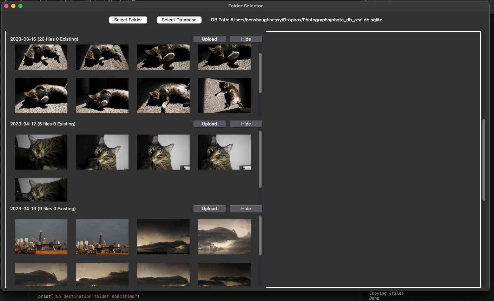
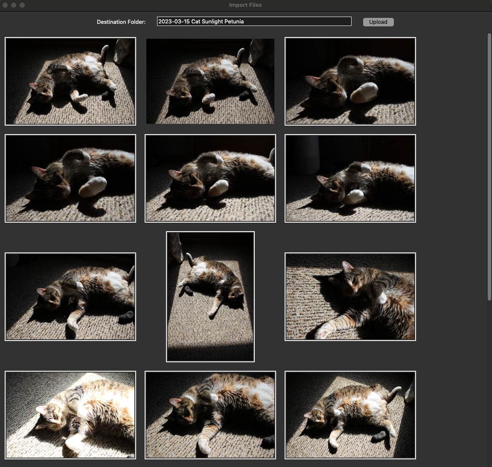

## Raw file Indexer and DSLR and SD-Card import tool

Goal is to make it easier for me to find photos on SD cards that I have never imported, both new 'shoots' (set of images on the same date) and images that may be part of an existing shoot/folder but not imported.

## Examples

### Index

```
> python src\main.py index E:/Dropbox/Photographs/ --database data/photo_db_real.db.sqlite
Folders:   9%|█████████▋                                                                                             | 14/149 [00:39<05:28,  2.43s/it]
Files: 2017-10-14 150 North Riverside plaza:  14%|█████████▌                                                         | 17/119 [00:02<00:11,  8.67it/s]
```

### Import

#### Screenshot - Viewing image thumbnails by date



### Screenshot - Selecting photos from date to import to new folder


